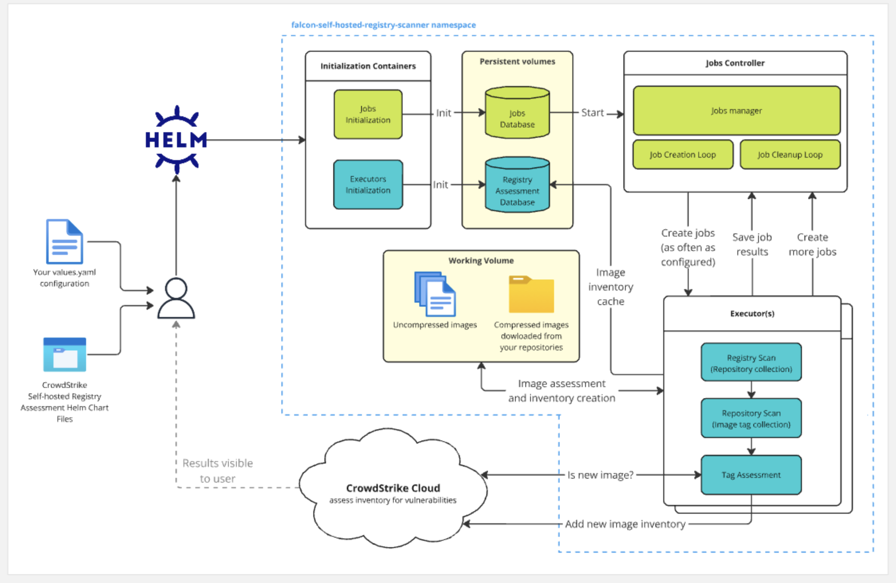

# Beta Release for CrowdStrike Self-hosted Registry Assessment (SHRA) Helm Chart 
CROWDSTRIKE CONFIDENTIAL / PROPRIETARY INFORMATION FOR BETA RELEASE ONLY

[Falcon](https://www.crowdstrike.com/) is the [CrowdStrike](https://www.crowdstrike.com/)
platform purpose-built to stop breaches via a unified set of cloud-delivered
technologies that prevent all types of attacks — including malware and much
more.

This helm chart helps you deploy CrowdStrike's self-hosted registry scanner to create inventories of the container images in your registries. The software sends the inventories up to the CrowdStrike cloud where they are analyzed for vulnerabilities and reported in your Falcon console. With this scanner, your images stay in your environment. This approach is an alternative to CrowdStrike's cloud-based [Cloud Workload Protection](https://www.crowdstrike.com/platform/cloud-security/cwpp/), where images are copied into the CrowdStrike registry to create the image inventories. 

Choosing to use the self-hosted approach vs CrowdStrike's cloud-based Cloud Workload Protection solution has a cost implication.
For example, running these services in your environment requires additional storage and computing time.
These costs may or may not be offset by the savings for data egress costs incurred with the cloud-based Cloud Workload Protection solution. 

## Table of Contents

- [Supported registries (beta)](#supported-registries-beta)
- [Supported registries (planned)](#supported-registries-planned)
- [How it works](#how-it-works)
- [Kubernetes cluster compatibility](#kubernetes-cluster-compatibility)
- [Dependencies](#dependencies)
- [Create a basic config file](#create-a-basic-config-file)
- [Customize your deployment](#customize-your-deployment)
  - [Configure your CrowdStrike credentials](#configure-your-crowdstrike-credentials)
  - [Configure SHRA image download](#configure-shra-image-versions-and-download-registry)
  - [Configure which registries to scan](#configure-which-registries-to-scan)
  - [Configure persistent data storage](#configure-persistent-data-storage)
  - [Configure temporary storage](#configure-temporary-storage)
  - [Optional. Allow traffic to CrowdStrike servers](#optional-allow-traffic-to-crowdstrike-servers)
  - [Optional. Configure CrowdStrike allow list](#optional-configure-crowdstrike-allow-list)
  - [Optional. Configure gRPC over TLS](#optional-configure-grpc-over-tls)
  - [Optional. Configure HTPP Proxy](#optional-configure-http-proxy)
- [Forward SHRA Container Logs to Logscale](#forward-shra-container-logs-to-logscale)
- [Install the SHRA Helm Chart](#install-the-shra-helm-chart)
- [Update SHRA](#update-shra)
- [Uninstall SHRA](#uninstall-shra)
- [Falcon chart configuration options](#falcon-chart-configuration-options)

## Supported registries (beta)

* Docker Hub
* JFrog Artifactory
* Sonatype Nexus

### Supported registries (planned)

* Amazon Elastic Container Registry (AWS ECR)
* Docker Registry V2
* GitHub
* GitLab
* Google Artifact Registry (GAR)
* Google Container Registry (GCR)
* Harbor
* IBM Cloud
* Microsoft Azure Container Registry (ACR)
* Mirantis Secure Registry (MSR)
* Oracle Container Registry
* Red Hat OpenShift
* Red Hat Quay.io

## High level instructions

In brief, you'll do the following steps outlined in this README to get registries scanned.

* Add CrowdStrike's SHRA Helm chart to your helm repo or download the chart from our GitHub repo.
* Create a `values_override.yaml` file to configure your deployment. For details, see [Customize your deployment](#customize-your-deployment). 
* Configure a LogScale Collector for SHRA container logs.
* Download the SHRA container image files from CrowdStrike's registry (and, best practice, save to your own registry). 
* Run the Helm install command to deploy the chart. 
* As the Helm is deployed, the following things happen:
  * Your configured registry connections are validated.
  * A jobs database is initialized in persistent storage.
  * A registry assessment cache is initialized in persistent storage.
  * A `Job Controller` pod spins up. 
  * One or more `Executor` pods spin up. 
* As often as you've configured, the `Job Controller` triggers the following in the `Executor` pods.
	1. `Registry scan` identifies the repositories within your configured registries. 
	1. `Repository scan` identifies image tags within your repositories. 
	1. `Tag assessment` checks the local registry assessment database for image tags found. If an image tag is not found in the local database, `Tag assessment` asks the CrowdStrike cloud if the image is new. If determined to be new, the image is uncompressed and inventoried. 
	1. New image inventories are sent to the CrowdStrike Cloud. 
* The CrowdStrike cloud scans inventoried images. 
* You can view the results in the Falcon console. Go to [**Cloud security** > **Vulnerabilities** > **Image assessments**](https://falcon.crowdstrike.com/cloud-security/cwpp/image-assessment/images), then click the **Images** tab.

## How it works

The job controller tells the executor(s) which registries to scan and how often, as per your configured cron schedule. 
If multiple registries are configured within your installation, the jobs are worked in a round robin approach to balance between the registries. 

The executor(s) perform the following three tasks:
1. `Registry scan`: identifies the repositories within the registry
1. `Repository scan`: identifies the tags within the repositories
1. `Tag assessment`: downloads image tags, creates a full inventory of what is in the image, sends that inventory to CrowdStrike's cloud for analysis.

To streamline work, `Tag assessment` uses a local registry assessment database to determine if the tags found in the scrape need assessment. If a tag is not found in the local database, it asks the CrowdStrike cloud if the image is new. Only images that have not been inventoried before are unpacked and inventoried. 

Three volume mounts are needed for SHRA.
1. A 1+ Gigabyte persistent volume for a job controller sqlite database
1. A 1+ Gigabyte persistent volume used by executor(s) for a registry assessment cache.
1. A working volume to store and expand images for assessment.

**Note:** Performance of the `Registry scan` and `Repository scan` jobs are networking bound, for the most part. 
By contrast, the `Tag assessment` job is mainly constrained by the amount of available disk space to unpack the images and perform the inventory. 
Review the [temporary storage](#configure-temporary-storage) section to ensure you provide sufficient disk space.



## Kubernetes cluster compatibility

The Falcon Self-hosted Registry Scanner Helm chart has been tested to deploy on the following Kubernetes distributions:

* Amazon Elastic Kubernetes Service (EKS) - EKS and EKS Fargate
* Azure Kubernetes Service (AKS)
* Google Kubernetes Engine (GKE)
* SUSE Rancher K3s
* Red Hat OpenShift Kubernetes

## Dependencies

* Requires an x86_64 Kubernetes cluster.
* [Helm](https://helm.sh/) 3.x is installed and supported by the Kubernetes vendor.
* [Cert Manager - Helm](https://cert-manager.io/docs/installation/helm/) if you wish to use TLS between the containers in this chart. See [TLS Configuration](#optional-configure-grpc-over-tls).
* 2 [Persistent Volume](#configure-persistent-data-storage) claims
* 1 Volume (persistent or emptyDir) of [sufficient size](#configure-temporary-storage) for unpacking and assessing images
* Networking sufficient to communicate with CrowdStrike cloud services.
* Access to the Falcon console (to set up the [Logscale integration](#forward-shra-container-logs-to-logscale))

**Note:** For more information on SHRA's supported persistent volume storage schemes, see [Configure persistent data storage](#configure-persistent-data-storage).

## Create a basic config file

To install this Helm chart, there are several config values to customize for your specific use case.

Copy the following code block into a new file called `values_override.yaml`.
Follow the steps in [Customize your deployment](#customize-your-deployment) to configure these values.

**Tip:** If you have experience deploying other CrowdStrike Helm charts, you can refer to [Falcon chart configuration options](#falcon-chart-configuration-options) for details on how to customize the fields in this minimal installation example. 

```yaml
executor:
  image:
    registry: "registry.crowdstrike.com/falcon-self-hosted-scanner/us-1/release/falcon-self-hosted-scanner"
    repository: "registryassessmentexecutor"
    tag: "0.3.0"

  dbStorage:
    storageClass: "k8s-dependent-storage-path"

  assessmentStorage:
    type: "PVC"
    pvc:
      storageClass: "k8s-dependent-storage-path"

jobController:
  image:
    registry: "registry.crowdstrike.com/falcon-self-hosted-scanner/us-1/release/falcon-self-hosted-scanner"
    repository: "cloud/cs-job-controller"
    tag: "0.10.0"

  dbStorage:
    storageClass: "k8s-dependent-storage-path"

crowdstrikeConfig:
  clientID: "XXXXX"
  clientSecret: "XXXXXX"

registryConfigs:
  - type: dockerhub
    credentials:
      username: "username"
      password: "XXXXXXXXX"
    port: "443"
    host: "https://registry-1.docker.io"
    cronSchedule: "0 0 * * *"
```

## Customize your deployment

Configure your deployment of the Self-hosted Registry Assessment tool by editing values in your `values_override.yaml` files.

The most commonly used parameters are described in the steps below. 
For other options, refer to the [full set of configurations options](#falcon-chart-configuration-options) and the comments in provided `values.yaml`.

### Configure your CrowdStrike credentials 

To download and operate CrowdStrike's self-hosted registry assessment tool, you need a CrowdStrike API client ID and secret with the required API scopes.

Create your client ID and secret: 
1. In the Falcon console, go to [**Support and resources** > **Resources and tools** > **API clients and keys**](https://falcon.crowdstrike.com/api-clients-and-keys/).
1. Click **Add new API client**.
1. In the **Add new API client** dialog, enter a client name and description that identifies this key is for self-hosted registry assessment.
1. Set the following API scopes
   * **Falcon Container CLI**: Write
   * **Falcon Container Image**: Read/Write
   * **Falcon Images Download**: Read
   * **Sensor Download**: Read  
1. Click **Add**.
1. From the **API client created** dialog, copy the **client ID** and **secret** to a password management or secret management service. 

**Note:** The API client secret will not be presented again, so don't close the dialog until you have it safely saved. 

Export these variables for use in later steps:
```sh
export FALCON_CLIENT_ID=<your-falcon-api-client-id>
export FALCON_CLIENT_SECRET=<your-falcon-api-client-secret>
```

Configure the following two parameters in your `values_override.yaml` file.

| Parameter                           |           | Description                                                | Default   |
|:------------------------------------|-----------|:-----------------------------------------------------------|:----------|
| `crowdstrikeConfig.clientID`        | required  | client id generated in the CrowdStrike Falcon console      | ""        |
| `crowdstrikeConfig.clientSecret`    | required  | client secret generated in the CrowdStrike Falcon console  | ""        |

### Configure SHRA image versions and download registry

Our self-hosted registry assessment tool is composed of two OCI images:
* `job-controller` 
* `executor`

You specify what versions of `job-controller` and `executor` that you want to install.
This Helm Chart downloads those images from your specified image registry and deploys with your custom configurations.

There are a few ways to get details about available images, including the [Falcon sensor pull script](https://github.com/CrowdStrike/falcon-scripts/tree/main/bash/containers/falcon-container-sensor-pull) and the CrowdStrike CLI.
Tools like [skopeo](https://github.com/containers/skopeo) can help you get image digests.

#### Download the Falcon Sensor Pull script

These instructions use the [Falcon sensor pull script](https://github.com/CrowdStrike/falcon-scripts/tree/main/bash/containers/falcon-container-sensor-pull) to log in and authenticate with the CrowdStrike registry to retrieve list of available images. 

Download the script locally and make it executable:

```sh
curl -sSL -o falcon-container-sensor-pull.sh "https://raw.githubusercontent.com/CrowdStrike/falcon-scripts/main/bash/containers/falcon-container-sensor-pull/falcon-container-sensor-pull.sh"
chmod u+x ./falcon-container-sensor-pull.sh
```

#### List available images

Use the pull script to fetch the image tags for the SHRA `job-controller` image to see available tag versions:
```
./falcon-container-sensor-pull.sh \
  --list-tags \
  -t falcon-self-hosted-scanner-job-controller
```

Repeat the same for the `executor` image:
``` sh
./falcon-container-sensor-pull.sh \
  --list-tags \
  -t falcon-self-hosted-scanner-executor
```

Output from the command above will be similar to this:
``` json
{
  "name": "falcon-self-hosted-scanner-executor",
  "repository": "registry.crowdstrike.com/falcon-self-hosted-scanner/us-1/release/falcon-self-hosted-scanner",
  "tags": [
    "1.0.0",
    "1.0.1",
    "1.0.2",
    "1.0.3"
  ]
}
```

The pull script makes use of the `FALCON_CLIENT_ID` and `FALCON_CLIENT_SECRET` environment variables you exported in earlier steps.
If you're in a new terminal window or if running the commands above causes authorization errors, repeat the variable exports described in [Configure your CrowdStrike credentials](#configure-your-crowdstrike-credentials). 

Make a note of the latest image tag for both `executor` and `job-controller` images.

**Note**: We recommend using digests instead of tags when selecting an image version. 
Use a tool like [skopeo](https://github.com/containers/skopeo) to identify your desired image digests.

#### Option 1. Copy the images to your repository

There are two ways to download the SHRA image:
1. **Recommended.** Download and store the image files in your registry. 
1. Use the CrowdStrike registry. 

We recommend that you pull the two SHRA images from the CrowdStrike registry and store them in your own registry.
However, if you've decided to always obtain the SHRA images from the CrowdStrike cloud, skip this section and proceed to [Option 2. Use the CrowdStrike image registry](#option-2-use-the-crowdstrike-image-registry).

**Note**: These steps assume that:
   * you created a registry to store the SHRA images
   * you have the required permissions to write to that registry
   * you've configured local authentication to your registry
   * you have environment variables set for `FALCON_CLIENT_ID` and `FALCON_CLIENT_SECRET` as described in [Configure your CrowdStrike credentials](#configure-your-crowdstrike-credentials). 

Use the script copy the SHRA `job-controller` image to your registry:
``` sh
./falcon-container-sensor-pull.sh \
  -u $FALCON_CLIENT_ID \
  -s $FALCON_CLIENT_SECRET \
  -c myregistry.com/crowdstrike-images/falcon-self-hosted-scanner-job-controller \
  -t falcon-self-hosted-scanner-job-controller \
  -v <job-controller image version tag>
```

And repeat for the `executor` image:
``` sh
./falcon-container-sensor-pull.sh \
  -u $FALCON_CLIENT_ID \
  -s $FALCON_CLIENT_SECRET \
  -c myregistry.com/crowdstrike-images/falcon-self-hosted-scanner-executor \
  -t falcon-self-hosted-scanner-executor \
  -v <executor image version tag>
```

Once you've copied both images, use `docker images | grep falcon` to verify that you see both the `job-controller` and `executor` images in your registry.

##### Generate a credentials string for your registry

If your private registry requires authentication, the Helm chart configuration needs that information. 
This is most commonly done with a base64 encoded string of you docker config json.

If your credentials are in `~/.docker/config.json`, use the following command to get the string:
``` sh
cat ~/.docker/config.json | base64 -
```

Keep this value handy for the next steps, you'll use it to configure `executor.image.registryConfigJSON` and `jobController.image.registryConfigJSON`.

#### Option 2. Use the CrowdStrike image registry

If you followed option 1 and copied the SHRA images to a private registry, skip ahead to [Add registry and image details to the configuration](#add-registry-and-image-details-to-the-configuration). 

To deploy the self-hosted registry assessment images from the CrowdStrike registry, you'll need:
* image pull tokens for each image
* the CrowdStrike registry that matches your assigned CrowdStrike cloud

##### Find your CrowdStrike registry

It's very important to match your configured registry with the CrowdStrike cloud you've been assigned.
A mismatch between your assigned cloud and the CrowdStrike registry used will cause an authorization failure when you try to download the images.

If you access the Falcon console at `falcon.crowdstrike.com`, your assigned CrowdStrike cloud is `us-1`. 
For all other clouds, the cloud location (`us-2`, `eu-1`, `gov-1`, or `gov-2`) is visible in the Falcon console URL.

Determine your assigned cloud and select the matching CrowdStrike registry location from this list:
* `us-1` use `registry.crowdstrike.com/falcon-self-hosted-scanner/us-1/release/falcon-self-hosted-scanner`
* `us-2` use `registry.crowdstrike.com/falcon-self-hosted-scanner/us-2/release/falcon-self-hosted-scanner`
* `eu-1` use `registry.crowdstrike.com/falcon-self-hosted-scanner/eu-1/release/falcon-self-hosted-scanner`
* `gov-1` use `registry.laggar.gcw.crowdstrike.com/falcon-self-hosted-scanner/gov-1/release/falcon-self-hosted-scanner`
* `gov-2` use `registry.us-gov-2.crowdstrike.mil/falcon-self-hosted-scanner/gov-2/release/falcon-self-hosted-scanner`

##### Get a CrowdStrike pull token

The CrowdStrike registry requires pull token authentication, which you can get with the Falcon sensor pull script. 
The pull script makes use of the `FALCON_CLIENT_ID` and `FALCON_CLIENT_SECRET` environment variables you exported in earlier steps.
If you're in a new terminal window repeat the variable exports described in [Configure your CrowdStrike credentials](#configure-your-crowdstrike-credentials). 

**Note:** If you use the Falcon console on `gov-1` or `gov-2` cloud, refer to the pull script's [Readme](https://github.com/CrowdStrike/falcon-scripts/tree/main/bash/containers/falcon-container-sensor-pull) to configure your region for the next command.

Fetch the SHRA `job-controller` pull token, which will be printed to stdout:

``` sh
./falcon-container-sensor-pull.sh \
  -t falcon-self-hosted-scanner-job-controller \
  --get-pull-token
```

Repeat the same for the `executor` pull token:
``` sh
./falcon-container-sensor-pull.sh \
  -t falcon-self-hosted-scanner-executor \
  --get-pull-token
```

Keep these value handy for the next steps, you'll use it to configure `executor.image.registryConfigJSON` and `jobController.image.registryConfigJSON`.

#### Add registry and image details to the configuration

Now that you've gathered the necessary information for your private registry or the CrowdStrike registry, verify and adjust image registry location, version tags, and authentication data in your `values_override.yaml` file. 

| Parameter                             |         | Description                                                                                                                                 | Default                       |
|:--------------------------------------|:--------|:--------------------------------------------------------------------------------------------------------------------------------------------|:------------------------------|
| `executor.image.registry`             |required | The registry to pull the `executor` image from. We recommended that you store this image in your registry.                                  |                               |
| `executor.image.repository`           |         | The repository for the `executor` image.                                                                                                    | "registryassessmentexecutor"  |
| `executor.image.digest`               |      required or `executor.image.tag`   | The sha256 digest for the `executor` image to pull. This value overrides the `executor.image.tag` field.                                    | ""                            |
| `executor.image.tag`                  |    required or `executor.image.digest`     | Tag for the `executor` image to pull. Ignored if `executor.image.digest` is supplied. We recommended use of `digest` instead of `tag`.      | ""                            |
| `executor.image.pullPolicy`           |         | Policy for determining when to pull the `executor` image.                                                                                   | "IfNotPresent"                |
| `executor.image.pullSecret`           |         | Use this to refer to an existing secret in the namespace.                                                                                   | ""                            |
| `executor.image.registryConfigJSON`   |         | `executor` pull token from CrowdStrike or the base64 encoded docker secret for your private registry.                                       | ""                            |
| `jobController.image.registry`           |required | The registry to pull the `job-controller` image from. We recommended that you store this image in your registry.                                | ""                            |
| `jobController.image.repository`         |         | The repository for the `job-controller` image.                                                                                                  | "job-controller"                  |
| `jobController.image.digest`             | required or `jobController.image.tag`        | The sha256 digest for the `job-controller` image to pull. This value overrides the `jobController.image.tag` field.                                | ""                            |
| `jobController.image.tag`                |  required or `jobController.image.digest`       | Tag for the `job-controller` image to pull. Ignored if `jobController.image.digest` is supplied. We recommended use of `digest` instead of `tag`.  | ""                            |
| `jobController.image.pullPolicy`         |         | Policy for determining when to pull the `job-controller` image.                                                                                 | "IfNotPresent"                |
| `jobController.image.pullSecret`         |         | Use this to refer to an existing secret in the namespace                                                                                    | ""                            |
| `jobController.image.registryConfigJSON` |         | `job-controller` pull token from CrowdStrike or the base64 encoded docker secret for your private registry.                                     | ""                            |

### Configure which registries to scan

The Self-hosted Registry Scanner can watch one or more registries.
Note that if you configure multiple registries, jobs are scheduled round robin to balance between them.

Configure your list by adding an object within the `registryConfigs` array. 
For example, if you have two registries, the first with a weekly scan schedule and the second with a daily scan schedule:
```yaml 
registryConfigs:
  - type: dockerhub
    credentials:
      username: "myuser"
      password: "xxxyyyzzz"
    port: "5000"
    host: "https://registry-1.docker.io"
    cronSchedule: "0 0 * * 7"
  - type: dockerhub
    credentials:
      username: "anotheruser"
      password: "qqqrrrsss"
    port: "5000"
    host: "https://registry-2.docker.io"
    cronSchedule: "0 0 * * *"
```

#### Use already existing kubernetes secrets for registry authentication

We recommend you follow security best practices and avoid saving your registry username and password in plaintext. To support you in this, our helm chart works with Kubernetes secrets.

This works whether you pull docker images with Kubernetes pullsecrets or if you have another method that injects docker credentials into Kubernetes secrets.
First, create a named secret in the [Kubernetes pullsecret format](https://kubernetes.io/docs/tasks/configure-pod-container/pull-image-private-registry).
Then, in your values_override.yaml file, replace the username and password parameters with with kubernetesSecretName and kubernetesSecretNamespace (both are required).

| Parameter                                                 |                                                      | Description                                                                                           | Default |
|:----------------------------------------------------------|:-----------------------------------------------------|:------------------------------------------------------------------------------------------------------|:--------|
| `registryConfigs.*.type`                                  | required                                             | Registry type being assessed. One of "dockerhub", "sonatype nexus", or "artifactory".                 | ""      |
| `registryConfigs.*.credentials.username`                  | required without `kubernetesSecretName`              | The username used to authenticate to the registry.                                                    | ""      |
| `registryConfigs.*.credentials.password`                  | required without `kubernetesSecretName`              | The password used to authenticate to the registry.                                                    | 
| `registryConfigs.*.credentials.kubernetesSecretName`      | required with `kubernetesSecretNamespace`            | The kubernetes secret name that contains registry credentials.                                        | ""      |
| `registryConfigs.*.credentials.kubernetesSecretNamespace` | required with `kubernetesSecretName`                 | The namespace containing the kubernetes secret with credentials.                                      | ""      |""       |
| `registryConfigs.*.port`                                  | required if non default (80 for http, 443 for https) | The port for connecting to the registry.                                                              | ""      |
| `registryConfigs.*.host`                                  | required                                             | The host for connecting to the registry.                                                              | ""      |
| `registryConfigs.*.cronSchedule`                          | required                                             | A cron schedule that controls how often the top level registry collection job is created.             | ""      |


### Configure persistent data storage

SHRA needs 2 persistent volume claims (PVC) for SQLite databases that allow the service to be resilient to down time and upgrades. 
The executor and job controller databases created in the PVCs start small and grow with usage, accumulating job and image information respectively.

We recommend a **minimum of 1 Gigabyte of storage** for each database. This allows for storage of 2 million image scans. 
To prevent the scanner from failing, persistent volume claims of the default size is created unless you configure use of an existing claim or change the default sizes.
You must provide the storage class type or existing claims in your `values_override.yaml` file, or deployment will fail.

If you have multiple registries, or wish to scan registries faster, we recommend you increase the executor database volume size.
You can also adjust job controller retention periods to reduce the footprint of the jobs database.
See [Change persistent storage retention](#change-persistent-storage-retention) for details.

**Important**: The Kubernetes Persistent Volume Claims your installation uses is specific to your particular kubernetes runtime and installation. 
Tell SHRA which storage class you're using by configuring `executor.dbStorage.storageClass` and `jobController.dbStorage.storageClass` in your `values_override.yaml` file.

See the following table for storage class options with  SHRA's supported runtimes.

| Runtime                      | Driver                               | Default storage class name | Storage provider  documentation                                                                                                                |
|------------------------------|--------------------------------------|----------------------------|------------------------------------------------------------------------------------------------------------------------------|
| EKS                          | EBS                                  | ebs-sc                     | https://docs.aws.amazon.com/eks/latest/userguide/ebs-csi.html                                                                |
| EKS                          | EFS                                  | efs-sc                     | https://docs.aws.amazon.com/eks/latest/userguide/efs-csi.html                                                                |
| AKS                          | Standard SSD LRS                     | managed-csi                | https://learn.microsoft.com/en-us/azure/aks/concepts-storage#storage-classes                                                 |
| AKS                          | Azure Standard storage               | azurefile-csi              | https://learn.microsoft.com/en-us/azure/aks/concepts-storage#storage-classes                                                 |
| GKE                          | Compute Engine persistent disk       | standard                   | https://cloud.google.com/kubernetes-engine/docs/concepts/persistent-volumes#storageclasses                                   |
| K3s                          | Local Storage Provider               | local-path                 | https://docs.k3s.io/storage#setting-up-the-local-storage-provider                                                            |
| Red Hat OpenShift Kubernetes | Depends on underlying infrastructure |                            | https://docs.openshift.com/container-platform/4.16/storage/container_storage_interface/persistent-storage-csi-sc-manage.html |


The following snippet shows how to use an existing storage claim for `executor.dbStorage` while allowing the container to create its own storage for `jobController.dbStorage`.

```yaml
executor:
  dbStorage:
    create: false
    existingClaimName: falcon-executor-db
    accessModes:
      - "ReadWriteOnce"
    storageClass: 

jobController:
  dbStorage:
    create: true
    existingClaimName: ""
    storageClass: "ebs-sc"
    size: 1Gi
    accessModes:
      - ReadWriteOnce
    storageClass: 
```

Add and adjust the following lines in your `values_override.yaml` file to configure your persistent storage. 

| Parameter                                    |         | Description                                                                                                                                               | Default              |
|:---------------------------------------------|:--------|:----------------------------------------------------------------------------------------------------------------------------------------------------------|:---------------------|
| `executor.dbStorage.create`                  |required | `true` to create a persistent volume claim (PVC) storage for the executor's db cache file. `false` to use existing storage.                               | true                 |
| `executor.dbStorage.existingClaimName`       |         | Name of existing storage to use instead of creating one. Required if `executor.dbStorage.create` is `false`.                                              | ""                   |
| `executor.dbStorage.size`                    |         | Size of the storage claim to create for the executor's database.                                                                                          | "1Gi"                |
| `executor.dbStorage.accessModes`             |         | Array of access modes for the executor's database claim.                                                                                                  | "- ReadWriteOnce"    |
| `executor.dbStorage.storageClass`            |required | Storage class to use when creating a persistent volume claim for the `executor` db cache. Examples include "ebs" in AKS and "standard-rwo" in GKE.        | ""                   |
| `jobController.dbStorage.create`                |required | `true` to create a persistent volume (PVC) storage for the job controller sqlite database file.                                                               | true                 |
| `jobController.dbStorage.existingClaimName`     |         | Name of existing storage to use instead of creating one. Required if `jobController.dbStorage.create` is `false`.                                            | ""                   |
| `jobController.dbStorage.size`                  |         | Size of the storage claim to create for the job controller's database.                                                                                        | "1Gi"                |
| `jobController.dbStorage.accessModes`           |         | Array of access modes for the job controller's database claim.                                                                                                | "- ReadWriteOnce"    |
| `jobController.dbStorage.storageClass`          |required | Storage class to use when creating a persistent volume claim for the job controller database. Examples include "ebs" in AKS and "standard-rwo" in GKE.      | ""                   |

#### Change persistent storage retention

To reduce the footprint of the `executor` database, you can adjust data retention periods for each of the three main jobs `executor` completes.
Be aware that a longer retention period may be helpful to facilitate debugging any potential registry assessment issues.

Retention for each of the three job types is 60400 seconds (7 days) unless you specify a different value when deploying the helm chart.

To change the default data retention for these job types, add or replace the following values in your `values_override.yaml` file.

| Parameter                                                               |         | Description                                                                           | Default   |
|:------------------------------------------------------------------------|:--------|:--------------------------------------------------------------------------------------|:----------|
| `crowdstrikeConfig.jobTypeConfigs.registryCollection.jobRetentionMax`   |         | Time in seconds to retain a registry scan job before deleting.                        | 604800    |
| `crowdstrikeConfig.jobTypeConfigs.tagScrape.jobRetentionMax`            |         | Time in seconds to retain a repository scan / tag scrape job before deleting.         | 604800    |
| `crowdstrikeConfig.jobTypeConfigs.tagAssessment.jobRetentionMax`        |         | Time in seconds to retain a completed tag assessment job before deleting.             | 604800    |


### Configure temporary storage

The self-hosted registry scanner pulls and decompresses each image it scans to traverse through layers, image configs, and manifests. 
To do this, it needs some scratch disk space. 

You can provide a temp empty directory mount or another container storage interface (CSI). 
Size is important because if you provide too little storage it can be a significant bottleneck for processing images. 

__The minimum size of this mount is 3x the size of your largest compressed image.__  
To prevent the scanner from failing, a persistent volume claim of 100 Gigabytes is created unless you configure use of an existing claim, or change the default value.
You must provide the storage class type or an existing claim in your `values_override.yaml` file, or deployment will fail.

Larger volume mounts allow for image scanning concurrency and faster results.

**Important:** The self-hosted scanner is forced to skip images that are too large to copy, unpack, and assess in the allocated storage space.

Configure your temporary storage location by editing the following lines to your `values_override.yaml` file. 

| Parameter                                           |             |Description                                                                                                                                                                                                             | Default           |
|:----------------------------------------------------|------------:|:-----------------------------------------------------------------------------------------------------------------------------------------------------------------------------------------------------------------------|:------------------|
| `executor.assessmentStorage.type`                   |required     | The type of storage volume to use for downloading and unpacking images. One of `local` or `PVC`. `local` creates an emptyDir mount. `PVC` creates a persistent volume claim.                                           | "PCV"             |
| `executor.assessmentStorage.size`                   |             | Size of claim to create. Required when the `assessmentStorage.type` is `PVC`. Setting this too small causes issues including skipped image assesments. Min recommended size is 3x your largest compressed image.       | "100Gi"           |
| `executor.assessmentStorage.pvc.create`             |             | If `true`, creates the persistent volume claim for assessment storage. Default setting is to create a PVC unless you modify the config.                                                                                | true              |
| `executor.assessmentStorage.pvc.existingClaimName`  |             | An existing storage claim name you wish to use instead of the one created above. Required if `executor.assessmentStorage.pvc.create` is false.                                                                         | ""                |
| `executor.assessmentStorage.pvc.storageClass`       |required     | Storage class to use when createing a persistent volume claim for the assessment storage. Examples include "ebs" in AKS and "standard-rwo" in GKE.                                                                     | ""                |
| `executor.assessmentStorage.pvc.accessModes`        |             | Array of access modes for this database claim.                                                                                                                                                                         | "- ReadWriteOnce" |

### Optional. Allow traffic to CrowdStrike servers

SHRA requires internet access to your assigned CrowdStrike upload servers. 
If your network requires it, configure your allow lists with your assigned CrowdStrike cloud servers. 
For more info, see [CrowdStrike domains and IP addresses to allow](https://falcon.crowdstrike.com/documentation/page/a2a7fc0e/crowdstrike-oauth2-based-apis#e590c681).

### Optional. Configure CrowdStrike allow list

By default, API access to your CrowdStrike account is not limited by IP address. 
However, we offer the option to restrict access by IP addresses or ranges to ensure your account is only accessed from specific networks.

Note that if your account is already IP address restricted, requests from other IPs (including the one where you're deploying SHRA) will be denied access and result in an `HTTP 403 "Access denied, authorization failed"` error.

To protect your account, or add your SHRA IP details to the CrowdStrike allow list for your CID, see [IP Allowlist Management](https://falcon.crowdstrike.com/documentation/page/a80757b1/ip-allowlist-management).


### Optional. Configure gRPC over TLS

The Job Controller and Executor pods communicate with one another over gRPC. 
If you wish, you can configure TLS for communication between these pods with either [cert-manager](https://cert-manager.io/) or your own certificate files. 

To enable TLS (regardless of the option you choose) add the following line to your `values_override.yaml` file

| Parameter                                   | | Description                                                                                                   | Default     |
|:--------------------------------------------|-|:--------------------------------------------------------------------------------------------------------------|:------------|
| `tls.enable`                                | | `true` to enforce TLS for job information communication between the `executor` pods and `job-controller`          | false       |

See [full `values.yaml` configuration options](#falcon-chart-configuration-options) for complete TLS configuration.

#### Option 1. Enable gRPC TLS with Cert Manager

Cert-manager is a native Kubernetes certificate management controller. 
It can help automate certificate management in cloud-native environments.

Add the Jetstack Helm repository:

```sh
helm repo add jetstack https://charts.jetstack.io --force-update
```
Install cert-manager with Helm:

```sh
helm install \
  cert-manager jetstack/cert-manager \
  --namespace cert-manager \
  --create-namespace \
  --version v1.15.2 \
  --set crds.enabled=true
```

| Parameter                                 |   | Description                                                                                                                                                                                                         | Default     |
|:------------------------------------------|---|:--------------------------------------------------------------------------------------------------------------------------------------------------------------------------------------------------------------------|:------------| 
| `tls.useCertManager`                      |   | When `tls.enable` is set to true, this field determines if cert manager should be used to create and control certificates. See [tls configuration](#optional-configure-grpc-over-tls) for more information.         | true        |

##### Option 2. Enable gRPC TLS with custom secret

If you have an existing certificate as a kubernetes secret you wish to use for these pods, provide them as the `tls.existingSecret`.

| Parameter                                 |   | Description                                                                                                    | Default     |
|:------------------------------------------|---|:---------------------------------------------------------------------------------------------------------------|:------------|
| `tls.existingSecret`                      |   | Specify an existing Kubernetes secret instead of cert manager.                                                 | ""          |

##### Option 3. Enable gRPC TLS with custom certificate files

If you have existing certificate files you wish to use for these pods, provide them as the `tls.issuer`.

| Parameter                                 |   | Description                                                                                                    | Default     |
|:------------------------------------------|---|:---------------------------------------------------------------------------------------------------------------|:------------|
| `tls.issuer`                              |   | Reference to an existing cert manager Issuer or ClusterIssuer, used for creating the TLS certificates.         | {}          |

### Optional. Configure HTTP Proxy

If needed, you can route HTTP traffic through a proxy for your registry connections and/or CrowdStrike connections.
There are three environment variables you can set for the executor by configuring `proxyConfig` in your `values_override.yaml` file:


| Parameter                                 |   | Description                                                                                                   | Default     |
|:------------------------------------------|---|:--------------------------------------------------------------------------------------------------------------|:------------|
| `proxyConfig.HTTP_PROXY`                  |   | Proxy URL for HTTP requests unless overridden by NO_PROXY.                                                    | ""          |
| `proxyConfig.HTTPS_PROXY`                 |   | Proxy URL for HTTPS requests unless overridden by NO_PROXY.                                                   | ""          |
| `proxyConfig.NO_PROXY`                    |   | Hosts to exclude from proxying. Provide as a string of comma-separated values.                                | ""          |

## Forward SHRA Container Logs to LogScale

[Falcon LogScale](https://www.crowdstrike.com/platform/next-gen-siem/falcon-logscale/) is part of CrowdStrike's Next-Gen SIEM for central log management. The LogScale Kubernetes Collector can be deployed in the SHRA namespace within Kubernetes for forwarding log messages from the applications used in registry assessment. 

By forwarding logs from the SHRA up to LogScale, you can more easily monitor and alert on the health of your registry assessments. Setting up this log collector is optional, but highly recommended. 

Please note that if you need assistance with SHRA deployment or ongoing activity with your self-hosted registry scans, CrowdStrike will request that you add the log collector to your installation. 
Your SHRA container logs are important diagnostic and troubleshooting tools.

### Create the HEC Ingest Connector

The first step is to create a Data Connector to accept HTTP Event Connector (HEC) source logs. The Kubernetes Collector sends logs over HTTP, so we will configure LogScale to accept the new source. Full documentation on setup and configuration of the HEC Data Connector can be found in [CrowdStrike's Documentation](https://falcon.crowdstrike.com/documentation/page/bdded008/hec-http-event-connector-guide). 

1. In the Falcon console go to go to [**Next-Gen SIEM** > **Data sources**](https://falcon.crowdstrike.com/data-connectors/).
1. Select **HEC / HTTP Event Connector**.
1. On the **Add new connector** page, fill the following fields:
   * Data detais:
     * Data source: `<Provide a name such as Self-hosted Registry Assessment Containers>`
     * Data type: `JSON`
   * Connector details:
     * Connector name: `<Provide a name such as SHRA Log Connector>`
     * Description: `<Provide a description such as Logs to use for monitoring and alerts>`
   * Parser details: `json (Generic Source)`
1. Agree to the terms for third party data sources and click **Save**.
1. When the connector is created and ready to receive data, a message box appears at the top of the screen. 
Click **Generate API key**. 
1. From the **Connection setup** dialog, copy the **API key** and **API URL** to a password management or secret management service. 

   Modify the API URL by removing `/services/collector` from the end. Your value will look like: `https://123abc.ingest.us-1.crowdstrike.com` where the first subdomain (`123abc` in this example) is specific to your connector.

   **Note:** The API Key will not be presented again, so don't close the dialog until you have it safely saved. 

1. Export these variables for use in later steps:
   ```sh
   export LOGSCALE_URL=<your-logscale-api-url without /services/collector>
   export LOGSCALE_KEY=<your-logscale-key>
   ```

### Start the Kubernetes LogScale Collector in your SHRA namespace

LogScale provides a [Kubernetes Log Collector](https://library.humio.com/falcon-logscale-collector/log-collector-kubernetes-helm-config.html) that can be configured with helm. 

1. Create a secret for your LogScale API key within kubernetes.
   ```sh
   kubectl create secret generic logscale-collector-token --from-literal=ingestToken=${LOGSCALE_KEY} --namespace registry-scanner
   ```

2. Add the logscale helm repository.
   ```sh
   helm repo add logscale-collector-helm https://registry.crowdstrike.com/log-collector-us1-prod 
   ```

3. Install the collector in your SHRA namespace. 
   ```sh
   helm install -g logscale-collector-helm/logscale-collector --namespace registry-scanner --set humioAddress=${LOGSCALE_URL},humioIngestTokenSecretName=logscale-collector-token
   ```

#### Validate logs in the UI

The LogScale Collector should now be shipping logs up to LogScale within your CrowdStrike Falcon console. 

To verify that the Connector is receiving data:
1. From the Falcon console go to go to [**Data connectors** > **My connectors**](https://falcon.crowdstrike.com/data-connectors/connectors).
1. In the list, find the connector you created and check its status. If it's receiving data, it's status is **Active**.

To view the logs from this connector:
1. Go to [**Next-Gen SEIM** > **Log management ** > **Advanced event search**](https://falcon.crowdstrike.com/investigate/search?end=&query=kubernetes.namespace%20%3D%20%22registry-scanner%22&repo=all&start=30m).  
1. Filter by the kubernetes namespace by adding the following to the query box (adjust if you chose a different namespace)
   `kubernetes.namespace = "registry-scanner"`. 
1. Click `Run` to see the results.

### Configure saved searches for monitoring SHRA

Now that your SHRA logs are ingested by LogScale, you can configure scheduled searches to be notified of any issues your SHRA may have in connecting to registries or performing assessment. 

1. Go to [**Next-Gen SEIM** > **Log management ** > **Advanced event search**](https://falcon.crowdstrike.com/investigate/search?end=&query=kubernetes.namespace%20%3D%20%22registry-scanner%22&repo=all&start=30m).  

1. Modify the query to search for errors. We recommend the following broad search filter:

   ```
   kubernetes.namespace = "registry-scanner"
   | "level=Error"
   ```

1. Follow our NG-SEIM instuctions to [Schedule your search](https://falcon.crowdstrike.com/documentation/page/a4275adf/scheduled-searches-for-edr). You'll be notified when any issues arise that you need to correct regarding registry connections. 


## Install the SHRA Helm Chart

Before you install, follow the steps above to prepare your accounts and create a `values_override.yaml` file with your customizations.

1. Add the CrowdStrike Falcon Helm repository

   ```sh
   helm repo add crowdstrike https://crowdstrike.github.io/falcon-helm
   ```

2. Update the local Helm repository cache

   ```sh
   helm repo update
   ```

3. Install the chart, using your configuration file to specify all the variables.

   ```sh
   helm upgrade --install -f </path/to/values_override.yaml> \
         --create-namespace -n registry-scanner registry-scanner </path/to/downloaded/charts_dir>
   ```

   For more details, see the [falcon-helm](https://github.com/CrowdStrike/falcon-helm) repository.

4. Verify installation

   ```sh
   helm show values crowdstrike/registry-scanner
   ```

The job controller and executor are now live,
The first registry scans will begin according to your configured cron schedules associated with each registry.

The job controller and executor are now live, and the first registry scans will begin according to your configured cron schedules associated with each registry.

## Update SHRA

As needed, you can change your configuration values or replace the container images with new releases.

After making changes to your `values_override.yaml` file, use the `helm upgrade` command shown in [Install the SHRA Helm Chart](#install-the-shra-helm-chart).

## Uninstall SHRA

To uninstall, run the following command:
```sh
helm uninstall registry-scanner -n registry-scanner && kubectl delete namespace registry-scanner
```

## Falcon chart configuration options
The chart's `values.yaml` file includes more comments and descriptions in-line for additional configuration options.

| Parameter                                                |                       | Description                                                                                                                                                                                                                                                                                                                                                                                                                                                                         | Default                        |
|:---------------------------------------------------------|:----------------------|:------------------------------------------------------------------------------------------------------------------------------------------------------------------------------------------------------------------------------------------------------------------------------------------------------------------------------------------------------------------------------------------------------------------------------------------------------------------------------------|:-------------------------------|
| `nameOverride`                                                                 | | override generated name for k8bernetes labels                                                                                                                                                                                                                                                                                                                                                                                                                                       | ""                             |
| `fullnameOverride`                                                             | | override generated name prefix for deployed kubernetes objects                                                                                                                                                                                                                                                                                                                                                                                                                      | ""                             |
| `executor.replicaCount`                                                        | | The number of executor pods. This value can be increased for greater concurrency if CPU is the bottleneck.                                                                                                                                                                                                                                                                                                                                                                          | 1                              |
| `executor.image.registry`                                |required               | The registry to pull the executor image from. It is recommended that you store this image in your registry through the steps [outlined above](#store-and-pull-shra-images-from-your-registry).                                                                                                                                                                                                                                                                                      | ""                             |
| `executor.image.repository`                              |required               | The repository for the executor image file.                                                                                                                                                                                                                                                                                                                                                                                                                                         | "registryassessmentexecutor"   |
| `executor.image.digest`                                  |required or `executor.image.tag`               | The sha256 digest designating the executor image to pull. This value overrides the `executor.image.tag` field.                                                                                                                                                                                                                                                                                                                                                                      | ""                             |
| `executor.image.tag`                                     |required or `executor.image.digest`              | Tag designating the executor image to pull. Ignored if `executor.image.digest` is supplied. We recommended use of `digest` instead of `tag`.                                                                                                                                                                                                                                                                                                                                        | ""                             |
| `executor.image.pullPolicy`                                                    | | Policy for determining when to pull the executor image.                                                                                                                                                                                                                                                                                                                                                                                                                             | "IfNotPresent"                 |
| `executor.iamge.pullSecret`                                                    | | Use this to refer to an existing secret in the namespace.                                                                                                                                                                                                                                                                                                                                                                                                                           | ""                             |
| `executor.image.registryConfigJSON`                                            | | `executor` pull token from CrowdStrike or your private registry secret, base64 encoded.                                                                                                                                                                                                                                                                                                                                                                                           | ""                             |
| `executor.dbStorage.create`                              |required               | `true` to create a persistent volume claim (PVC) storage for the executor's db cache file. `false` to use existing storage.                                                                                                                                                                                                                                                                                                                                                         | true                           |
| `executor.dbStorage.storageClass`                        |required               | Storage class to use when creating a persistent volume claim for the `executor` db cache. Examples include "ebs" in AKS and "standard-rwo" in GKE.                                                                                                                                                                                                                                                                                                                                  | ""                             |
| `executor.dbStorage.existingClaimName`                                         | | Name of existing storage to use instead of creating one. Required if `executor.dbStorage.create` is `false`.                                                                                                                                                                                                                                                                                                                                                                        | ""                             |
| `executor.dbStorage.size`                                                      | | Size of the storage claim to create for the executor's database.                                                                                                                                                                                                                                                                                                                                                                                                                    | "1Gi"                          |
| `executor.dbStorage.accessModes`                                               | | Array of access modes for the executor's database claim.                                                                                                                                                                                                                                                                                                                                                                                                                            | "- ReadWriteOnce"              |
| `executor.assessmentStorage.type`                        |required               | The type of storage volume to use for downloading and unpacking images. One of `local` or `PVC`. `local` creates an emptyDir mount. `PVC` creates a persistent volume claim.                                                                                                                                                                                                                                                                                                        | "PCV"                          |
| `executor.assessmentStorage.size`                                              | | Size of claim to create. Required when the `assessmentStorage.type` is `PVC`. Setting this too small causes issues including skipped image assesments. Min recommended size is 3x your largest compressed image. See [Configure temporary storage](#configure-temporary-storage).                                                                                                                                                                                                   | "100Gi"                        |
| `executor.assessmentStorage.pvc.create`                                        | | If `true`, creates the persistent volume claim for assessment storage. Default setting is to create a PVC unless you modify the config.                                                                                                                                                                                                                                                                                                                                             | true                           |
| `executor.assessmentStorage.pvc.existingClaimName`                             | | An existing storage claim name you wish to use instead of the one created above. Required if `executor.assessmentStorage.pvc.create` is `false`.                                                                                                                                                                                                                                                                                                                                    | ""                             |
| `executor.assessmentStorage.pvc.storageClass`            |required               | Storage class to use when createing a persistent volume claim for the assessment storage. Examples include "ebs" in AKS and "standard-rwo" in GKE.                                                                                                                                                                                                                                                                                                                                  | ""                             |
| `executor.assessmentStorage.pvc.accessModes`                                   | | Array of access modes for the assessment storage volume claim.                                                                                                                                                                                                                                                                                                                                                                                                                      | "- ReadWriteOnce"              |
| `executor.logLevel`                                                            | | Log level for the `executor` service (1:error, 2:warning, 3:info, 4:debug)                                                                                                                                                                                                                                                                                                                                                                                                          | 3                              |
| `executor.labels`                                                              | | Additional labels to apply to the executor pods.                                                                                                                                                                                                                                                                                                                                                                                                                                    | {}                             |
| `executor.podAnnotations`                                                      | | Additional pod annotations to apply to the executor pods.                                                                                                                                                                                                                                                                                                                                                                                                                           | {}                             |
| `executor.nodeSelector`                                                        | | Node selector to apply to the executor pods.                                                                                                                                                                                                                                                                                                                                                                                                                                        | {}                             |
| `executor.resources`                                                           | | Resource limits and requests to set for the executor pods.                                                                                                                                                                                                                                                                                                                                                                                                                          | {}                             |
| `executor.tolerations`                                                         | | Kubernetes pod scheduling tolerations.                                                                                                                                                                                                                                                                                                                                                                                                                                              | []                             |
| `executor.affinity`                                                            | | Node affinity for the executor pods.                                                                                                                                                                                                                                                                                                                                                                                                                                                | []                             |
| `executor.priorityClassName`                                                   | | Set to system-node-critical or system-cluster-critical to avoid pod evictions due to resource limits.                                                                                                                                                                                                                                                                                                                                                                               | ""                             |
| `executor.additionalEnv`                                                       | | Additional environment variables to set for the executor pods.                                                                                                                                                                                                                                                                                                                                                                                                                      | []                             |
| `executor.additionalCMEEnvFrom`                                                | | Additional environment variables set from an existing config map.                                                                                                                                                                                                                                                                                                                                                                                                                   | []                             |
| `executor.additionalSecretEnvFrom`                                             | | Additional environment variables set from an existing secret.                                                                                                                                                                                                                                                                                                                                                                                                                       | []                             |
| `jobController.image.registry`                              |required               | The registry to pull the job-controller image from. It is recommended that you store this image in your registry.                                                                                                                                                                                                                                                                                                                                                                       | ""                             |
| `jobController.image.repository`                            |required               | The repository for the job-controller image.                                                                                                                                                                                                                                                                                                                                                                                                                                            | "job-controller"                   |
| `jobController.image.digest`                                |required or `jobController.image.tag`            | The sha256 digest designating the job-controller image to pull. This value overrides the `jobController.image.tag` field.                                                                                                                                                                                                                                                                                                                                                                    | ""                             |
| `jobController.image.tag`                                   |required or `jobController.image.digest`              | Tag designating the job-controller image to pull. Ignored if `jobController.image.digest` is supplied. We recommended use of `digest` instead of `tag`.                                                                                                                                                                                                                                                                                                                                      | ""                             |
| `jobController.image.pullPolicy`                                                  | | Policy for determining when to pull the job-controller image.                                                                                                                                                                                                                                                                                                                                                                                                                           | "IfNotPresent"                 |
| `jobController.image.pullSecret`                                                  | | Use this to refer to an existing secret in the namespace.                                                                                                                                                                                                                                                                                                                                                                                                                           | ""                             |
| `jobController.image.registryConfigJSON`                                          | | job-controller pull token from CrowdStrike or your private registry secret, base64 encoded.                                                                                                                                                                                                                                                                                                                                                                                           | ""                             |
| `jobController.service.type`                                                      | | Job Controller and Executor(s) communicate over IP via gRPC. This value sets the service type for executor(s) to communicate with Job Controller.                                                                                                                                                                                                                                                                                                                                               | "ClusterIP"                    |
| `jobController.service.port`                                                      | | The port that job-controller uses for its gRPC server with the executor(s)                                                                                                                                                                                                                                                                                                                                                                                                                 | "9000"                         |
| `jobController.dbStorage.create`                            |required               | `true` to create a persistent volume (PVC) storage for the job controller sqlite database file.                                                                                                                                                                                                                                                                                                                                                                                         | true                           |
| `jobController.dbStorage.existingClaimName`                                       | | Name of existing storage to use instead of creating one. Required if `jobController.dbStorage.create` is `false`.                                                                                                                                                                                                                                                                                                                                                                      | ""                             |
| `jobController.dbStorage.size`                                                    | | Size of the storage claim to create for the job controller's database.                                                                                                                                                                                                                                                                                                                                                                                                                  | "1Gi"                          |
| `jobController.dbStorage.storageClass`                      |required               | Storage class to use when creating a persistent volume claim for the job controller database. Examples include "ebs" in AKS and "standard-rwo" in GKE.                                                                                                                                                                                                                                                                                                                                | ""                             |
| `jobController.dbStorage.accessModes`                                             | | Array of access modes for the job controller's database claim.                                                                                                                                                                                                                                                                                                                                                                                                                          | "- ReadWriteOnce"              |
| `jobController.logLevel`                                                          | | Log level for the job controller service (1:error, 2:warning, 3:info, 4:debug)                                                                                                                                                                                                                                                                                                                                                                                                        | 3                              |
| `jobController.labels`                                                            | | Additional labels to apply to the job-controller pod.                                                                                                                                                                                                                                                                                                                                                                                                                                   | {}                             |
| `jobController.podAnnotations`                                                    | | Additional pod annotations to apply to the job-controller pod.                                                                                                                                                                                                                                                                                                                                                                                                                          | {}                             |
| `jobController.nodeSelector`                                                      | | Node selector to apply to the job-controller pod.                                                                                                                                                                                                                                                                                                                                                                                                                                       | {}                             |
| `jobController.resources`                                                         | | Resource limits and requests to set for the job-controller pod.                                                                                                                                                                                                                                                                                                                                                                                                                         | {}                             |
| `jobController.tolerations`                                                       | | Kubernetes pod scheduling tolerations.                                                                                                                                                                                                                                                                                                                                                                                                                                              | []                             |
| `jobController.affinity`                                                          | | Node affinity for the job-controller pod.                                                                                                                                                                                                                                                                                                                                                                                                                                               | []                             |
| `jobController.priorityClassName`                                                 | | Set to system-node-critical or system-cluster-critical to avoid pod evictions due to resource limits.                                                                                                                                                                                                                                                                                                                                                                               | ""                             |
| `jobController.additionalEnv`                                                     | | Additional environment variables to set for the job-controller pod.                                                                                                                                                                                                                                                                                                                                                                                                                     | []                             |
| `jobController.additionalCMEEnvFrom`                                              | | Additional environment variables set from an existing config map.                                                                                                                                                                                                                                                                                                                                                                                                                   | []                             |
| `jobController.additionalSecretEnvFrom`                                           | | Additional environment variables set from an existing secret.                                                                                                                                                                                                                                                                                                                                                                                                                       | []                             |
| `crowdstrikeConfig.region`                                                | | The region for this CID in CrowdStrike's cloud. Valid values are "autodiscover", "us-1", "us-2", "eu-1", "gov1", and "gov2".                                                                                                                                                                                                                                                                                                                                                                     | "autodiscover"                             |
| `crowdstrikeConfig.clientID`                             |required               | The client id used to authenticate the self-hosted registry assessment service with CrowdStrike.                                                                                                                                                                                                                                                                                                                                                                                        | ""                             |
| `crowdstrikeConfig.clientSecret`                         |required               | The client secret used to authenticate the self-hosted registry assessment service with CrowdStrike.                                                                                                                                                                                                                                                                                                                                                                                    | ""                             |
| `crowdstrikeConfig.jobTypeConfigs.registryCollection.threadsPerPod`            | | The number of threads working on registry collection jobs. This job type is IO bound. Increasing this value allows collecting repositories from multiple registries concurrently. Increase this number if you have a significant number (100+) of registries.                                                                                                                                                                                                                       | 1                              |
| `crowdstrikeConfig.jobTypeConfigs.registryCollection.allowConcurrentIdentical` | | We strongly recommended you leave this set to the default `false`. Set to `true` to allow the same registry to be scraped by multiple worker threads simultaneously.                                                                                                                                                                                                                                                                                                                | false                          |
| `crowdstrikeConfig.jobTypeConfigs.registryCollection.runtimeMax`               | | The maximum amount of seconds an executor is allowed for scraping the list of repositories from a registry.                                                                                                                                                                                                                                                                                                                                                                         | 480                            |
| `crowdstrikeConfig.jobTypeConfigs.registryCollection.retriesMax`               | | The maximum number of attempts at scraping the list of repositories from a registry.                                                                                                                                                                                                                                                                                                                                                                                                | 0                              |
| `crowdstrikeConfig.jobTypeConfigs.registryCollection.jobRetentionMax`          | | Time in seconds to retain a registry scan job before deleting. Keeping these job records longer may facilitate debugging potential registry assessment issues.                                                                                                                                                                                                                                                                                                                      | 604800                         |
| `crowdstrikeConfig.jobTypeConfigs.tagScrape.threadsPerPod`                     | | The number of threads working on repository scrape jobs. This job is responsible for determining the tags associated with an individual repository. This job type is IO bound. Increasing this value allows scraping multiple repositories within the same registry concurrently. Increasing this number puts additional load on your registry with concurrent docker API calls.                                                                                                    | 1                              |
| `crowdstrikeConfig.jobTypeConfigs.tagScrape.allowConcurrentIdentical`          | | We strongly recommended you leave this set to the default `false`. Set to `true`  to allow the same repository to be scraped by multiple worker threads simultaneously.                                                                                                                                                                                                                                                                                                             | false                          |
| `crowdstrikeConfig.jobTypeConfigs.tagScrape.runtimeMax`                        | | The maximum amount of seconds an executor is allowed for scraping the list of tags from a repository                                                                                                                                                                                                                                                                                                                                                                                | 480                            |
| `crowdstrikeConfig.jobTypeConfigs.tagScrape.retriesMax`                        | | The maximum number of attempts at scraping the list of tags from a repository                                                                                                                                                                                                                                                                                                                                                                                                       | 0                              |
| `crowdstrikeConfig.jobTypeConfigs.tagScrape.jobRetentionMax`                   | | Time in seconds to retain a repository scan / tag scrape job before deleting. Keeping these job records longer may facilitate debugging potential registry assessment issues.                                                                                                                                                                                                                                                                                                       | 604800                         |
| `crowdstrikeConfig.jobTypeConfigs.tagAssessment.threadsPerPod`                 | | The number of threads working on tag assessment jobs. This job is responsible downloading an image, unpacking it, and creating the inventory for what is in the image. This job type is IO and disk bound so increasing this would allow donwloading and unpacking images concurrently. Increasing this number puts additional load on your registry with concurrent docker API calls. See the `executor.assessmentStorage` settings to address disk bottlenecks                    | 8                              |
| `crowdstrikeConfig.jobTypeConfigs.tagAssessment.allowConcurrentIdentical`      | | We strongly recommended you leave this set to the default `false`. Set to `true`  to allow the same image tag to be downloaded, unpacked and inventories by multiple worker threads simultaneously.                                                                                                                                                                                                                                                                                 | false                          |
| `crowdstrikeConfig.jobTypeConfigs.tagAssessment.runtimeMax`                    | | The maximum amount of seconds an executor is allowed for downloading, unpacking, creating an inventory and sending it to the cloud.                                                                                                                                                                                                                                                                                                                                                 | 480                            |
| `crowdstrikeConfig.jobTypeConfigs.tagAssessment.retriesMax`                    | | The maximum number of attempts at assessing a tag image.                                                                                                                                                                                                                                                                                                                                                                                                                            | 0                              |
| `crowdstrikeConfig.jobTypeConfigs.tagAssessment.jobRetentionMax`               | | Time in seconds to retain a completed tag assessment job before deleting. Keeping these job records longer may facilitate debugging potential registry assessment issues.                                                                                                                                                                                                                                                                                                           | 604800                         |
| `registryConfigs`                                                              | | An array of registries to be assessed.                                                                                                                                                                                                                                                                                                                                                                                                                                              | ""                             |
| `registryConfigs.*.type`                                                       | | The registry type being assessed. One of "dockerhub", "sonatype nexus", or "artifactory".                                                                                                                                                                                                                                                                                                                                                                                           | ""                             |
| `registryConfigs.*.credentials.username`                                       | | The username used to authenticate to the registry.                                                                                                                                                                                                                                                                                                                                                                                                                                  | ""                             |
| `registryConfigs.*.credentials.password`                                       | | The password used to authenticate to the registry.                                                                                                                                                                                                                                                                                                                                                                                                                                  | ""                             |
| `registryConfigs.*.port`                                                       | | The port for connecting to the registry.                                                                                                                                                                                                                                                                                                                                                                                                                                            | ""                             |
| `registryConfigs.*.allowedRepositories`                                        | | A comma separated list of repositories that should be assessed. If this value is not set, the default behavior, then all repositories within a registry will be assessed.                                                                                                                                                                                                                                                                                                           | ""                             |
| `registryConfigs.*.host`                                                       | | The host for connecting to the registry.                                                                                                                                                                                                                                                                                                                                                                                                                                            | ""                             |
| `registryConfigs.*.cronSchedule`                                               | | A cron schedule that controls how often the top level registry collection job is created.                                                                                                                                                                                                                                                                                                                                                                                           | ""                             |
| `tls.enable`                                                                   | | Set to `true` to enforce TLS communication between the executor pods and job-controller as they communicate job information over gRPC.                                                                                                                                                                                                                                                                                                                                                  | false                          |
| `tls.useCertManager`                                                           | | When `tls.enable` is `true`, this field determines if cert manager should be used to create and control certificates. See [tls configuration](#optional-configure-grpc-over-tls) for more information.                                                                                                                                                                                                                                                                              | true                           |
| `tls.existingSecret`                                                           | | Specify an existing Kubernetes secret instead of cert manager.                                                                                                                                                                                                                                                                                                                                                                                                                      | ""                             |
| `tls.issuer`                                                                   | | Reference to an existing cert manager Issuer or ClusterIssuer, used for creating the TLS certificates.                                                                                                                                                                                                                                                                                                                                                                              | {}                             |
| `proxyConfig.HTTP_PROXY`                                                       | | Proxy URL for HTTP requests unless overridden by NO_PROXY.                                                                                                                                                                                                                                                                                                                                                                                                                          | ""                             |
| `proxyConfig.HTTPS_PROXY`                                                      | | Proxy URL for HTTPS requests unless overridden by NO_PROXY.                                                                                                                                                                                                                                                                                                                                                                                                                         | ""                             |
| `proxyConfig.NO_PROXY`                                                         | | Hosts to exclude from proxying. Provide as a string of comma-separated values.                                                                                                                                                                                                                                                                                                                                                                                                      | ""                             |
